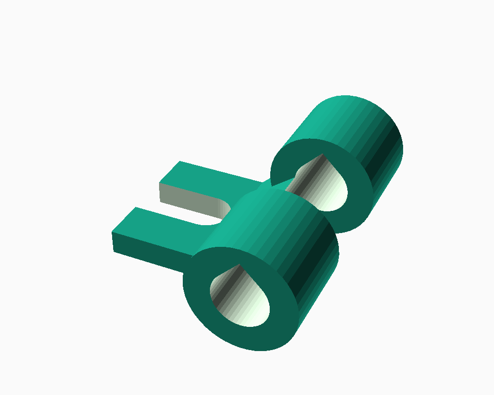
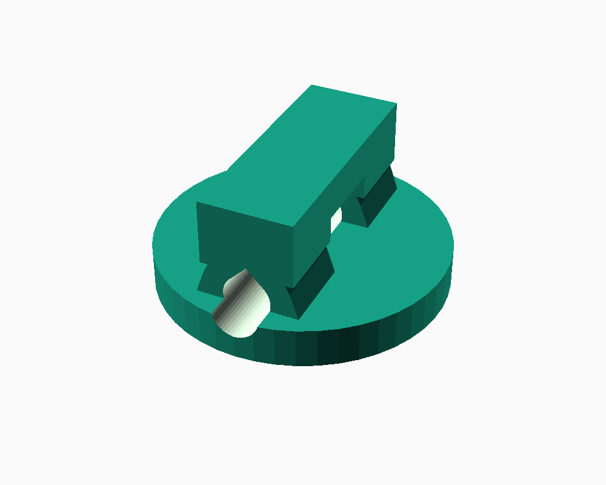
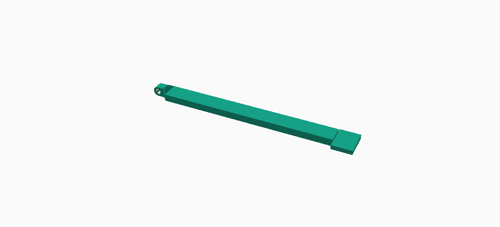

# Unity UN202 multimeter stand

A compact folding kickstand for the Unity UN202 clamp multimeter, using
the existing top case screw (the one just below the jaw) as the mount
point. Three printed parts (pick one of the two base options) plus,
for the screw-based base, one M3 screw and nut:

- **`base_tab()`** — a small tab with a plain, fully-enclosed hole for
  a *replacement* screw (head ~5mm, shank ~3mm — swap in for the
  original case screw). The original screw comes out completely, is
  passed through this hole from behind, and driven back into the
  case, so its head clamps the tab flush. Because it's a plain hole
  (not a slot), the tab can only come off by being fully unscrewed
  again.
- **`base_plug()`** — a hardware-free alternative: a peg that presses
  tightly into the screw's recess (~5.6mm) instead of using the screw
  at all. Split into flexible fingers (a simple collet) so it
  self-adjusts across a range of real hole sizes instead of relying on
  one exact diameter. Simpler assembly, but it means pulling the screw
  out permanently and relying on the peg's grip alone.
- **`leg()`** — attaches to whichever base through a printed knuckle
  hinge, pinned with an M3 screw and nut. This is the part that
  actually folds flat against the meter when stowed and swings out to
  prop it up when deployed. **The M3 nut is the friction adjustment**
  — tighter clamps the knuckles together harder, holding the leg at
  whatever angle you leave it, including flush against the case.

Render/print with:

```
openscad --render -o stand.stl stand.scad
```

## File formats

- `stand.stl` — all three parts, laid out for printing (this is what
  you actually print).
- `stand.step` — the same layout, converted to STEP for tools that
  need it.
- `step/base_tab.step`, `step/base_plug.step`, `step/leg.step` — each
  part individually, for importing into a CAD assembly.

**Important caveat on the STEP files:** OpenSCAD has no true CAD
kernel — every curved surface (every cylinder, every hole) is always a
faceted polygon approximation (controlled by `$fn`), never a smooth
analytic surface. The STEP files here are that same faceted mesh
wrapped in STEP's container format (converted from the STL with
OpenCASCADE), not a real parametric/smooth-surface model. They're
useful for tools that only accept STEP, or for importing into a CAD
assembly, but don't expect smooth cylinders if you inspect the
surfaces closely, and don't expect to edit dimensions non-destructively
the way you could with a native CAD part — `stand.scad` is still the
actual source of truth for any dimensional changes.

## Renders

All three parts, laid out as they print:


`base_tab` — thin insertion tab tapering into a thick hinge anchor:



`base_plug` — press-fit peg, flange, and the same thick hinge anchor:



`leg` — hinge knuckle, tapered strip, foot pad:



All parts are laid out flat side-by-side at the bottom of the file,
ready to print with no supports. Every M3 hinge bore uses a teardrop
profile (circle + a 45° point on top) instead of a plain round hole,
so it prints cleanly with no bridging/support even lying flat with the
bore axis horizontal. Each bore's cutter also extends well past the
finger/knuckle's own edges (not just ~1mm) — a smaller margin reliably
left a hair-thin sliver of uncut material right at the opening, close
enough to being a real M3 screw obstruction to fix outright. Verified
by literally modeling an M3 screw shaft and checking for zero overlap
with each part.

## Why two hinges' worth of thinking, but only one moving joint

The case screw's axis points straight into the case, so anything
pivoting directly on it can only sweep flat across the back (like a
clock hand) — it can't lift away from the surface to prop the meter
up. So the *base* (tab or plug) just anchors a fixed attachment point,
and a **separate** knuckle hinge (axis parallel to the case surface,
pinned by the M3 hardware) is what actually lets the leg fold out.
That second hinge is the only moving joint.

## Leg length math

With the meter resting on its bottom edge and tilted back to
`tilt_angle`, the top screw sits at height `screw_height_from_bottom *
sin(tilt_angle)` above the table. Swinging the leg out from
flush-against-the-case by `deploy_hinge_angle` needs a leg length of:

```
leg_length_raw = screw_height_from_bottom * sin(tilt_angle) / sin(tilt_angle - deploy_hinge_angle)
leg_length = leg_length_raw - leg_shorten
```

(`deploy_hinge_angle` must stay less than `tilt_angle`, or the leg
never reaches the table no matter how long it is.) All three inputs
are adjustable at the top of `stand.scad`. `leg_shorten` (25mm default)
trims the geometric result directly — in practice it came out longer
than the meter itself, and shortening it was simpler and more honest
than fudging `screw_height_from_bottom` (a measurement) or the angles
(deliberate choices) just to change the length.

## Before printing: verify these assumptions

- `screw_height_from_bottom` (115mm default): distance from the
  meter's bottom edge, along the back, up to the top screw. Estimated
  from product photos, not measured on your actual unit — **measure
  this**, it directly drives the leg length.
- `shank_d` (2.6mm default): diameter of the screw shank under the
  head. Only the head (5.1mm) and the recess it sits in (~5.6mm) were
  actually measured.
- `new_screw_head_d` (5mm) / `new_screw_shank_d` (3mm): the
  replacement screw's dimensions — both estimates, measure the actual
  screw you're using. `base_t` (1.6mm) no longer has to stay thinner
  than a loosened-screw gap now that the screw is fully removed for
  installation, but there's no reason to change it either. Past the
  screw hole, `base_tab` tapers up to a much thicker, wider anchor
  block (`base_thick_t` 5mm, `base_thick_w` 14mm) for the hinge
  fingers, the same reasoning as `base_plug`'s peg-to-flange taper.
- `base_w` (14mm default, up from 9mm): width of the zone the screw
  head clamps down on. Widened to match `base_thick_w` so the screw
  presses the tab against the case over a much bigger flat area
  instead of a strip barely wider than the head itself.
- `peg_len` (5.5mm default) and `peg_interference` (0.4mm default): how
  deep the screw's recess actually is, and how much oversized to print
  the peg for a tight press fit. `peg_len` is kept 0.5mm short of the
  full estimated recess depth so the peg doesn't bottom out/crash into
  whatever is at the base of that hole before the flange seats flush.
  Both are guesses — start with a test print of just `base_plug()`
  before committing to a full print. (Only matters for `base_plug`.)
- `base_plug`'s peg is split into `peg_slot_count` (3) flexible
  fingers by `peg_slots()` — a simple collet, so it self-adjusts to a
  slightly bigger or smaller real hole (compressing or springing out)
  instead of being one rigid diameter that's either loose or won't go
  in. `peg_solid_top` (1mm) keeps a solid, unsplit hub at the flange
  end for the fingers to cantilever from.
- `base_plug`'s flange (22mm diameter, 3mm thick) and gusseted fingers
  are sized to comfortably out-span the hinge fingers and give the
  leg's leverage a wide shoulder to load into — deliberately sturdier
  than the bare minimum, since this piece takes all the load with no
  screw backing it up.
- The hinge knuckle itself (`finger_w`, 6mm) is wider than the original
  design (4mm) since the leg's knuckle — the part actually cantilevering
  the leg's whole load — is only `finger_w - 0.4` wide, and 3.6mm was
  thin enough to be a real breakage risk.
- `base_tab` and `base_plug`'s two hinge fingers stay free-standing at
  the top -- deliberately. The gap above and between them is exactly
  where the leg's own strip has to sweep through as it pivots, so any
  fixed material bridging their tops (tried once, reverted) blocks the
  hinge from moving at all, even though it looks like harmless
  reinforcement in a static render.
- `base_tab`'s original taper only built up material on the near side
  (toward the tab) of each finger, leaving the far side of each
  cylinder completely unsupported. Fixed with a matching cap on that
  far side -- flat, at the same low Z as the rest of the anchor block
  (not stacked upward), and confined to each finger's own Y-width so
  it can't reach into the gap between them. Verified this doesn't
  introduce any new collision with the leg at any rotation angle
  (checked 0-180° in 15-30° steps): identical residual overlap with or
  without the cap, meaning what's left is a small pre-existing
  tolerance artifact from the tight ~0.2mm knuckle-to-gap clearance,
  not something this fix caused.
- `deploy_hinge_angle` (15° default): arbitrary choice balancing leg
  length against how far the leg has to swing out. Adjust and
  re-derive `leg_length` (automatic) if you want a shorter/longer leg.
- `base_gap_pad` (1.5mm) and `base_m3_hole_d` (4.2mm, up from the
  shared `m3_hole_d` 3.6mm): after printing the leg, its actual
  knuckle didn't leave a clear path for the M3 screw through both
  bases' finger holes — printed solid features commonly come out
  slightly oversized and holes slightly undersized, and a tight
  nominal fit and a tight nominal bore stack up fast. These two widen
  the bases' own finger gap and hinge bore only — `leg()`'s own
  dimensions (and the already-printed part) are completely untouched.
- `leg`'s foot pad matches the strip's own width/thickness (`foot_w` =
  `leg_w`, `foot_t` = `leg_t`) instead of being wider and thinner, so
  the whole leg is one constant rectangular cross-section end to end —
  it can be rotated 90° in the slicer (printed standing on edge for a
  different layer orientation) without a flared foot sticking out past
  the rotated profile.

## Assembly

**With `base_tab` (replacement screw):**
1. Remove the original case screw entirely.
2. Pass the replacement screw through `base_tab`'s hole from behind,
   then drive it into the case's original threaded hole. The bigger
   head clamps the tab flush against the case.

**With `base_plug` (no hardware, screw comes out):**
1. Remove the top case screw entirely.
2. Press `base_plug`'s peg firmly into the empty recess until the
   flange seats against the case. The split fingers should self-adjust
   to your actual hole size; sand the peg down a bit if it's still too
   tight to seat fully.

**Both:**
3. Sandwich `leg`'s knuckle between the base's two knuckles, push the
   M3 screw through, add the nut.
4. Tighten the nut until the leg holds its position under the meter's
   weight but you can still reposition it by hand.

## History

`renders/v1-rigid-prototype/` has renders of the very first design
iteration (a rigid, fixed-angle prop) that was replaced by the current
folding-hinge approach — kept for reference only.
